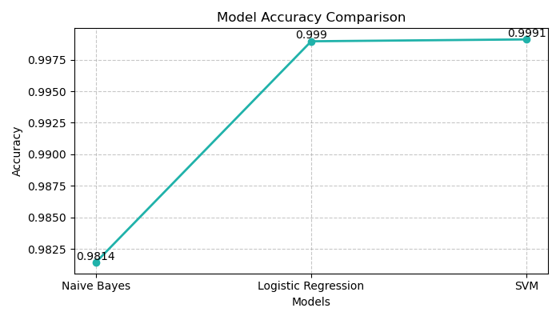

#  Spam Email Detection System

  

A Machine Learning-based project that classifies emails as **Spam** or **Not Spam** using Natural Language Processing (NLP) techniques and multiple classification algorithms.

##  Project Overview

This project aims to build an automated spam email detection system using machine learning. The model is trained on the **Enron Spam Dataset** and uses text preprocessing and TF-IDF feature extraction to classify emails.

The system compares multiple machine learning models and selects the best-performing one for prediction.

##  Algorithms Used

- Naïve Bayes  
- Logistic Regression  
- Support Vector Machine (SVM)  

##  Technologies & Libraries

- Python  
- Pandas  
- NumPy  
- NLTK  
- Scikit-learn  
- Matplotlib  
- Seaborn  

##  Project Structure
SPAM_EMAIL_DETECTION/
│
├── data/
│ ├── raw/
│ └── processed/
│
├── notebooks/
│ └── spam_email_detection.ipynb
│
├── models/
│
├── results/
│
├── report/
│
└── README.me

##  Workflow
Email Input
↓
Text Preprocessing
↓
TF-IDF Feature Extraction
↓
Machine Learning Model (SVM)
↓
Spam / Not Spam Prediction

##  Model Performance

| Model | Accuracy | Precision | Recall |
|------|---------|----------|--------|
| Naïve Bayes | 98.14% | 96.52% | 100% |
| Logistic Regression | 99.90% | 99.79% | 100% |
| SVM | **99.91%** | **99.82%** | **100%** |

##  Results

The **Support Vector Machine (SVM)** model achieved the best performance with the highest accuracy and precision.

- Confusion matrices generated for all models  
- Performance graphs (Accuracy, Precision, Recall)  
- Training vs Testing accuracy comparison  
- Model comparison visualization  

##  Example Prediction
Input: Hi John, let's schedule a meeting tomorrow morning.
Output: Not a Spam Email

##  Model Saving

Trained models and TF-IDF vectorizer are saved using `joblib`:

- naive_bayes_model.pkl  
- logistic_regression_model.pkl  
- svm_model.pkl  
- tfidf_vectorizer.pkl  

##  Dataset

- Enron Spam Dataset  
  https://www.kaggle.com/datasets/marcelwiechmann/enron-spam-data  

##  Future Improvements

- Deep learning models (LSTM, BERT)  
- Real-time email integration  
- Web-based spam detection interface  
- Multilingual spam detection  

##  Author

Your Name: Arsh Mohan Nishant

------

##  Acknowledgements

- Scikit-learn  
- NLTK  
- Kaggle Dataset Contributors  
